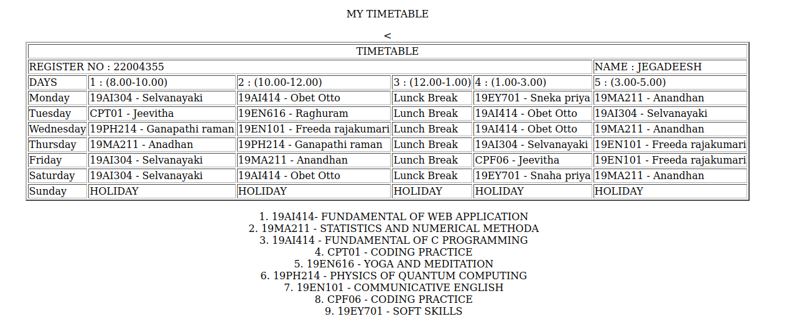

# Experiment_Time_Table

## AIM
To Write a html webpage page to display your timetable.

# ALGORITHM
### STEP 1
create a simple table using table tag
### STEP 2
Add header row using th tag
### STEP 3
Add your timetable
### STEP 4
Execute the program

# CODE
```html
<!DOCTYPE html>
<html lang="en">
    <head> 
        <title> TIMETABLE </title>
    </head>

    <body>
        <p> <center>MY TIMETABLE </center><p>
            <center>
            <table border="2"> 
                <tr>
                    <td align="center" colspan="6">TIMETABLE</td>
                </tr>
                <tr>
                    <td colspan="3">REGISTER NO : 22004355</td>
                    <td colspan="3">NAME : JEGADEESH</td>
                </tr>

                <tr>
                    <td>DAYS</td>
                    <td>1 : (8.00-10.00)</td>
                    <td>2 : (10.00-12.00)</td>
                    <td>3 : (12.00-1.00)</td>
                    <td>4 : (1.00-3.00)</td>
                    <td>5 : (3.00-5.00)</td>
                    
                </tr>
                <tr>
                    <td>Monday</td>
                    <td>19AI304 - Selvanayaki</td>
                    <td>19AI414 - Obet Otto</td>
                    <td>Lunck Break</td>
                    <td>19EY701 - Sneka priya</td>
                    <td>19MA211 - Anandhan</td>
                </tr>
                <tr>
                    <td>Tuesday</td>
                    <td>CPT01 - Jeevitha </td>
                    <td>19EN616 - Raghuram</td>
                    <td>Lunch Break</td>
                    <td>19AI414 - Obet Otto</td>
                    <td>19AI304 - Selvanayaki</td>
                </tr>
                <tr>
                    <td>Wednesday</td>
                    <td>19PH214 - Ganapathi raman</td>
                    <td>19EN101 - Freeda rajakumari</td>
                    <td>Lunch Break</td>
                    <td>19AI414 - Obet Otto</td>
                    <td>19MA211 - Anandhan</td>

                    
                </tr>
                <tr>
                    <td>Thursday</td>
                    <td>19MA211 - Anadhan</td>
                    <td>19PH214 - Ganapathi raman</td>
                    <td>Lunch Break</td>
                    <td>19AI304 - Selvanayaki</td>
                    <td>19EN101 - Freeda rajakumari</td>

                </tr>
                <tr>
                    <td>Friday</td>
                    <td>19AI304 - Selvanayaki</td>
                    <td>19MA211 - Anandhan</td>
                    <td>Lunch Break</td>
                    <td>CPF06 - Jeevitha</td>
                    <td>19EN101 - Freeda rajakumari</td>

                </tr>
                <tr>
                    <td>Saturday</td>
                    <td>19AI304 - Selvanayaki</td>
                    <td>19AI414 - Obet Otto</td>
                    <td>Lunck Break</td>
                    <td>19EY701 - Snaha priya</td>
                    <td>19MA211 - Anandhan</td>


                </tr>
                <tr>
                    <td>Sunday</td>
                    <td>HOLIDAY</td>
                    <td>HOLIDAY</td>
                    <td>HOLIDAY</td>
                    <td>HOLIDAY</td>
                    <td>HOLIDAY</td>

                </tr>
            <table> 
            </center>
            <center>
                <ol>
                    <li>19AI414- FUNDAMENTAL OF WEB APPLICATION</li>
                    <LI>19MA211 - STATISTICS AND NUMERICAL METHODA</LI>
                    <LI>19AI414 - FUNDAMENTAL OF C PROGRAMMING</LI>
                    <LI>CPT01 - CODING PRACTICE</LI>
                    <LI>19EN616 - YOGA AND MEDITATION</LI>
                    <LI>19PH214 - PHYSICS OF QUANTUM COMPUTING</LI>
                    <LI>19EN101 - COMMUNICATIVE ENGLISH</LI>
                    <LI>CPF06 - CODING PRACTICE</LI>
                    <LI>19EY701 - SOFT SKILLS</LI>
                </ol>
            </center>

        </body>
</html>
```

# OUTPUT:


# RESULT:
This is the HTML code to show an output of Timetable.
